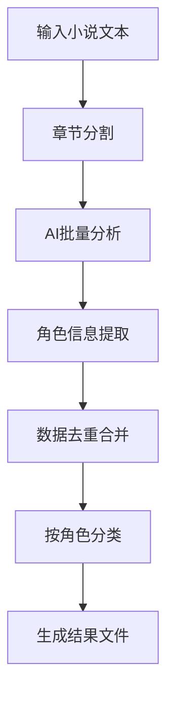

# AI-
专门用于提取大型网络小说角色名称和描述词
# 🤖 AI网络小说角色描述词提取系统

[](https://www.python.org/downloads/)
[](https://www.riverbankcomputing.com/software/pyqt/)
[](https://huggingface.co/Qwen)
[](LICENSE)

一个基于本地大语言模型的智能网络小说角色信息提取工具，能够自动分析中文小说文本并提取详细的角色描述信息。

## 🌟 核心功能

### 📊 智能角色分析
- **AI驱动的角色识别**：基于Qwen3-8B大语言模型，准确识别小说中的各类角色
- **多维度信息提取**：自动提取角色的姓名、别名、性别、年龄、职业、气质等关键信息
- **详细外观描述**：精确捕捉服饰、发型、饰品、特殊标记等外观特征
- **智能去重合并**：自动合并同一角色的多条描述，避免重复信息

### 🎯 专业文本处理
- **章节智能分割**：自动按"第X章"格式分割长篇小说
- **编码自动识别**：支持UTF-8、GBK、GB2312等常见中文编码
- **批量处理能力**：每3章为一批次进行AI分析，平衡效率与准确性
- **结果分类整理**：按角色名称自动分组保存，便于后续使用

### 🖥️ 用户友好界面
- **现代化GUI设计**：基于PyQt6的直观图形界面
- **实时系统监控**：CPU、内存、GPU使用率实时显示
- **一键式操作**：选择输入输出路径后，一键完成所有处理
- **进度可视化**：清晰显示处理进度和状态信息

## 🚀 快速开始

### 环境要求
- **操作系统**：Windows 10/11 (64位)
- **Python**：3.12 或更高版本
- **硬件要求**：
  - **最低配置**：8GB RAM，4GB显存显卡
  - **推荐配置**：16GB RAM，8GB显存显卡（NVIDIA GTX 1060以上）
  - **存储空间**：至少10GB可用空间（包含模型文件）

### 安装步骤

#### 1. 克隆项目
```bash
git clone https://github.com/your-username/novel-character-extractor.git
cd novel-character-extractor
```

#### 2. 安装依赖
```bash
pip install -r requirements.txt
```

#### 3. 下载AI模型
项目已内置Qwen3-8B模型，位于`models/Qwen3-8B/`目录。
如需更新模型，请从[Hugging Face](https://huggingface.co/Qwen/Qwen3-8B)下载。

#### 4. 启动程序
- **Windows用户**：双击`快速启动.bat`
- **命令行启动**：
  ```bash
  python gui.py
  ```

### 使用教程

#### 📖 基础使用流程
1. **启动程序**：运行`快速启动.bat`或`python gui.py`
2. **选择小说文件**：点击"浏览"选择要分析的小说文本文件
3. **设置输出目录**：选择角色描述信息的保存位置
4. **开始处理**：点击"开始处理"按钮，等待AI分析完成
5. **查看结果**：处理完成后，在输出目录查看角色信息文件

#### ⚙️ 高级选项
- **慢思考模式**：勾选后可提高分析准确性，但处理时间增加30-50%
- **批量处理**：支持同时处理多个小说文件
- **自定义输出**：可自定义角色信息的保存格式和目录结构

## 📁 项目结构

```
novel-character-extractor/
├── 📁 models/
│   └── 📁 Qwen3-8B/              # AI模型文件
├── 📁 exports/                   # 角色分析结果
├── 📁 Character_Descriptors/     # 按角色分类的详细描述
├── 📁 demerger/                  # 分割后的章节文件
├── 📁 logs/                      # 处理日志和错误信息
├── 📁 ui/                        # 界面资源文件
├── 🐍 gui.py                     # 主程序GUI
├── 🤖 Qwen3_backup.py           # AI处理核心
├── 📊 character_stats.py         # 角色统计整理
├── 🔍 filter_characters.py       # 结果过滤清理
├── 📈 sort_characters.py         # 角色排序分组
├── ✂️ split_novel.py            # 小说章节分割
├── 📋 requirements.txt           # Python依赖列表
├── 🔐 secure_launch.py          # 安全启动验证
└── 🚀 快速启动.bat               # Windows一键启动
```

## 🔧 技术架构

### 核心技术栈
- **AI引擎**：Qwen3-8B大语言模型
- **界面框架**：PyQt6 (Python GUI框架)
- **深度学习**：PyTorch + Transformers
- **系统监控**：psutil + pynvml
- **文本处理**：正则表达式 + JSON解析

### 处理流程


## 📊 输出格式

### 角色信息文件格式
每个角色生成一个独立的文本文件，包含以下信息：

```
角色名称: 张无忌
别名: 曾阿牛, 明教教主
性别: 男
职业: 明教教主, 武当弟子
年龄: 20岁
气质: 仁厚坚毅, 重情重义
服饰: 白色长衫, 明教教主服饰
发型: 长发束起, 武当弟子发式
饰品: 明教圣火令, 武当剑
特殊标记: 左臂有圣火纹身
```

### 统计报告
系统还会生成综合的统计报告，包含：
- 总角色数量
- 男女比例分析
- 年龄分布统计
- 职业类型统计
- 高频词汇分析

## ⚡ 性能优化

### 处理速度
- **单章节**：约30-60秒（取决于文本长度）
- **中等小说**（50万字）：约2-3小时
- **大型小说**（100万字以上）：建议分批处理

### 内存管理
- **自动清理**：处理完成后自动卸载模型释放内存
- **GPU缓存**：支持CUDA GPU加速和显存优化
- **垃圾回收**：智能内存回收机制

## 🛠️ 故障排除

### 常见问题

#### ❌ 启动失败
**问题**：双击无反应或报错
**解决**：
1. 检查Python版本是否为3.12+
2. 确认所有依赖已安装：`pip install -r requirements.txt`
3. 检查显卡驱动是否更新

#### ❌ 内存不足
**问题**：处理过程中内存溢出
**解决**：
1. 关闭其他占用内存的程序
2. 降低批量处理大小（修改Qwen3_backup.py中的批次大小）
3. 使用CPU模式运行（较慢但内存需求低）

#### ❌ 中文乱码
**问题**：输出文件中文显示乱码
**解决**：
1. 确认输入文件编码为UTF-8或GBK
2. 检查系统区域设置
3. 使用文本编辑器另存为UTF-8编码

### 错误日志
所有错误信息都会记录在`logs/error_log.txt`中，便于排查问题。

## 🤝 贡献指南

我们欢迎社区贡献！以下是参与方式：

### 🐛 报告Bug
1. 检查现有[Issues](https://github.com/your-username/novel-character-extractor/issues)
2. 创建新Issue，提供详细复现步骤
3. 附上相关日志文件（`logs/`目录下）

### 💡 功能建议
1. 在Issues中标记为`enhancement`
2. 描述清楚期望的功能和用途
3. 欢迎提交Pull Request实现功能

### 🔧 代码贡献
1. Fork本项目
2. 创建功能分支：`git checkout -b feature/AmazingFeature`
3. 提交更改：`git commit -m 'Add some AmazingFeature'`
4. 推送分支：`git push origin feature/AmazingFeature`
5. 创建Pull Request

## 📄 许可证

本项目采用MIT许可证 - 查看[LICENSE](LICENSE)文件了解详情。

## 🙏 致谢

- **Qwen团队**：提供强大的Qwen3-8B大语言模型
- **PyQt社区**：优秀的GUI开发框架
- **Hugging Face**：开源AI模型和工具链
- **开源社区**：所有为项目做出贡献的开发者

## 📞 联系方式

- **项目维护**：东方数学团队
- **邮箱联系**：contact@eastmath.com
- **技术讨论**：[GitHub Discussions](https://github.com/your-username/novel-character-extractor/discussions)
- **问题反馈**：[GitHub Issues](https://github.com/your-username/novel-character-extractor/issues)

---

<div align="center">
  <p><strong>⭐ 如果这个项目对你有帮助，请给个Star支持！</strong></p>
  <p>
    <a href="https://github.com/your-username/novel-character-extractor">
      
    </a>
  </p>
</div>
